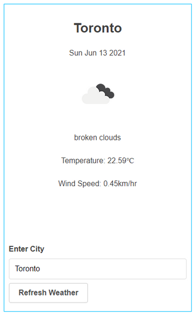

# my-weather-reactstore
This app detects a user's city and displays the current weather for that city. 

The app is a variation of [this](https://github.com/cek333/my-weather) React/Redux app; Redux has been replaced by a purely React store constructed using `useContext()` and `useReducer()`.

Weather data is obtained from the [OpenWeather API](https://openweathermap.org/api) via an intermediary GraphQL server: [https://github.com/konstantinmuenster/graphql-weather-api](https://github.com/konstantinmuenster/graphql-weather-api)

A user's approximate location is determined using the [InInfo.io API](https://ipinfo.io).

[Primitivie UI](https://taniarascia.github.io/primitive/) is used to provide basic styling.

[Immer](https://immerjs.github.io/immer/) is used to write immutable state transitions in the reducer. (Immer is used under-the-hood in the Redux Toolkit for the `createSlice()` function.)

## Setup
`npm install`

In one window, start the graphql-weather-api.

In the my-weather app folder, add a `.env` file and insert your IpInfo.io token:
```
REACT_APP_IPINFO_TOKEN=<token>
```
(For the purposes of this evaluation, a `.env` file has been checked in.)

Next, start the my-weather app: 

`npm run start`

## Tests
`npm run test`

## Usage
When the app starts, it will detect your city and display the weather for that city.



You can click the `Refresh Weather` button to reload the weather data. (Note however, in accordance with the OpenWeather usage guidelinies, new data is only fetched (for the city that's currently displayed) if 10min have elapsed. Otherwise, the existing data will be displayed.)

To get the weather for a different city, enter the city in the text box and click `Refresh Weather`.
